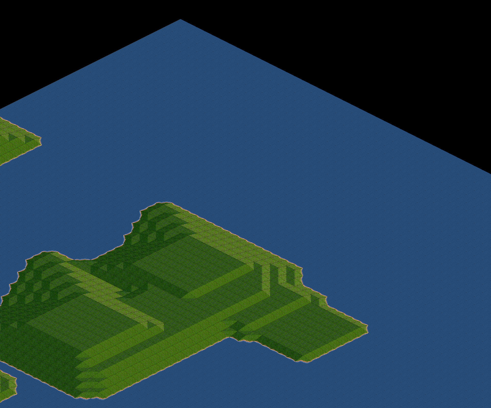
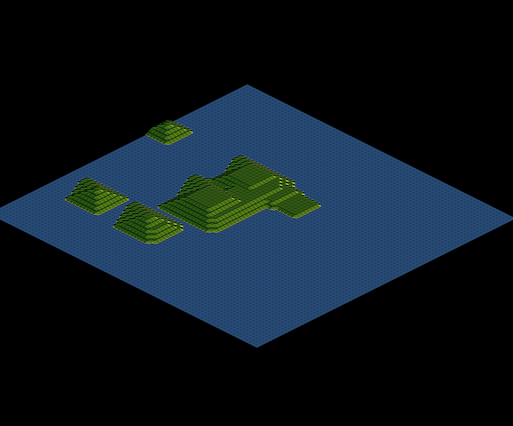

# SimpleBitmapMaprenderer #

General
-------
An attempt to get a basic maprendering running in C by using SDL2.  
The solution is sill under development, but working.

Install
-------
Build under Linux and Windows(Not Tested):

```
make
```


Screenshots
-----------
Testmap Megatest.bmp:


Testmap MegaTest.bmp rendered:


Zoomed view:


Testmap Europe:

